# 🚗 Vehicle Insurance Prediction — End-to-End MLOps Pipeline

> **An end-to-end production-oriented Machine Learning project that automates the complete lifecycle of a Vehicle Insurance Prediction model — from data ingestion and validation to model training, evaluation, versioning, deployment, and prediction through a web application.**

---

## 🎯 Project Overview

This project implements a complete **MLOps pipeline** for predicting whether a vehicle insurance customer is likely to show interest in purchasing vehicle insurance.

Rather than building only a machine learning model, the project focuses on the **entire ML lifecycle**:

**Data → Validation → Transformation → Training → Evaluation → Model Registry → Deployment → Prediction**

The system uses **MongoDB Atlas** for data storage, **AWS S3** for model storage/versioning, **FastAPI** for serving predictions, and **Docker + AWS EC2 + ECR + GitHub Actions** for deployment and CI/CD.

---

## ✨ Key Highlights

* 🧩 **Modular MLOps architecture** with separate components for every ML lifecycle stage
* 🍃 **MongoDB Atlas** integration for cloud-based dataset storage and ingestion
* 🔍 Automated **data validation** using schema configuration
* ⚙️ Dedicated **data transformation & preprocessing** pipeline
* 🤖 Automated **model training and evaluation**
* ☁️ **AWS S3 Model Registry** for storing trained models
* 📊 Configurable model evaluation threshold for deciding whether a new model should replace the existing model
* 🚀 **FastAPI prediction service** with an interactive web interface
* 🐳 **Dockerized application**
* 🔄 **CI/CD using GitHub Actions**
* 📦 **AWS ECR** for Docker image storage
* 💻 **AWS EC2** for application deployment
* 🏃 **Self-hosted GitHub Actions runner** on EC2
* 📝 Centralized logging and custom exception handling
* 🔐 Environment-based configuration for database and cloud credentials

---

# 🏗️ System Architecture

The overall architecture of the project can be summarized as:

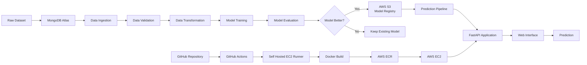

---

# 🔄 End-to-End ML Pipeline

The core machine learning workflow follows a modular pipeline:

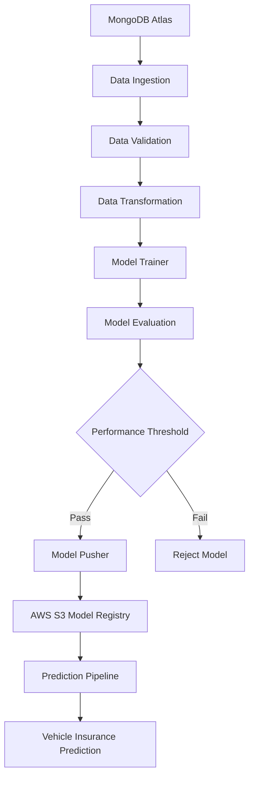

Each stage produces structured **configuration objects and artifacts**, making the pipeline easier to debug, maintain, and extend.

---

# 🗂️ Project Structure

```text
Vehicle-Insurance-Project/
│
├── .github/
│   └── workflows/
│       └── aws.yaml
│
├── artifacts/
│
├── notebook/
│   ├── EDA/
│   ├── Feature Engineering/
│   └── mongoDB_demo.ipynb
│
├── src/
│   │
│   ├── components/
│   │   ├── data_ingestion.py
│   │   ├── data_validation.py
│   │   ├── data_transformation.py
│   │   ├── model_trainer.py
│   │   ├── model_evaluation.py
│   │   └── model_pusher.py
│   │
│   ├── configuration/
│   │   ├── mongo_db_connection.py
│   │   └── aws_connection.py
│   │
│   ├── data_access/
│   │   └── proj1_data.py
│   │
│   ├── entity/
│   │   ├── config_entity.py
│   │   ├── artifact_entity.py
│   │   ├── estimator.py
│   │   └── s3_estimator.py
│   │
│   ├── pipline/
│   │   ├── training_pipeline.py
│   │   └── prediction_pipeline.py
│   │
│   ├── aws_storage/
│   │
│   ├── constants/
│   │   └── __init__.py
│   │
│   ├── exception.py
│   ├── logger.py
│   └── utils/
│       └── main_utils.py
│
├── static/
│   └── css/
│
├── templates/
│   └── vehicledata.html
│
├── app.py
├── demo.py
├── config/
│   └── schema.yaml
│
├── Dockerfile
├── .dockerignore
├── .gitignore
├── requirements.txt
├── setup.py
├── pyproject.toml
├── template.py
└── README.md
```

---

# 🧠 ML Pipeline Components

## 1. Data Ingestion

The pipeline retrieves the dataset stored in **MongoDB Atlas**.

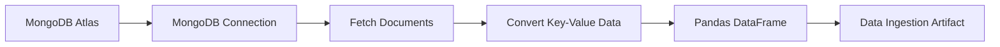

The ingestion component:

* Establishes the MongoDB connection
* Fetches documents from the collection
* Converts MongoDB records into a Pandas DataFrame
* Stores the resulting artifact for downstream components

---

## 2. Data Validation

Before training, the dataset is validated against a predefined schema.

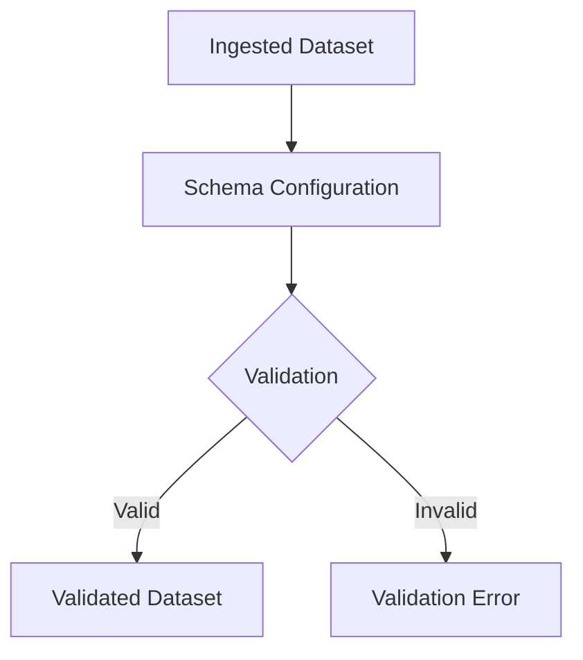

The schema configuration contains information about the expected dataset structure and features.

This prevents unexpected changes in the incoming data from silently propagating into the training pipeline.

---

## 3. Data Transformation

The validated dataset is transformed into a format suitable for model training.

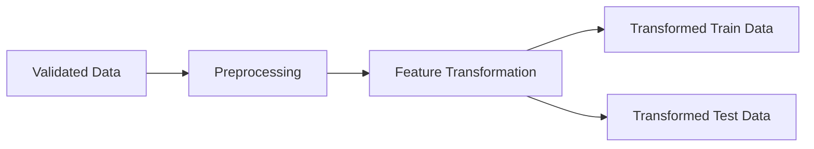

The transformation stage encapsulates preprocessing logic and generates the transformed datasets required by the model trainer.

---

## 4. Model Training

The transformed dataset is passed to the model training component.

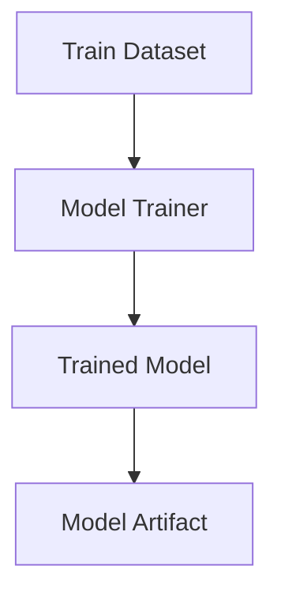

The training component is isolated from the rest of the pipeline, allowing the underlying estimator/model to be modified without changing the overall pipeline architecture.

---

## 5. Model Evaluation

A trained model is evaluated before being pushed to the model registry.

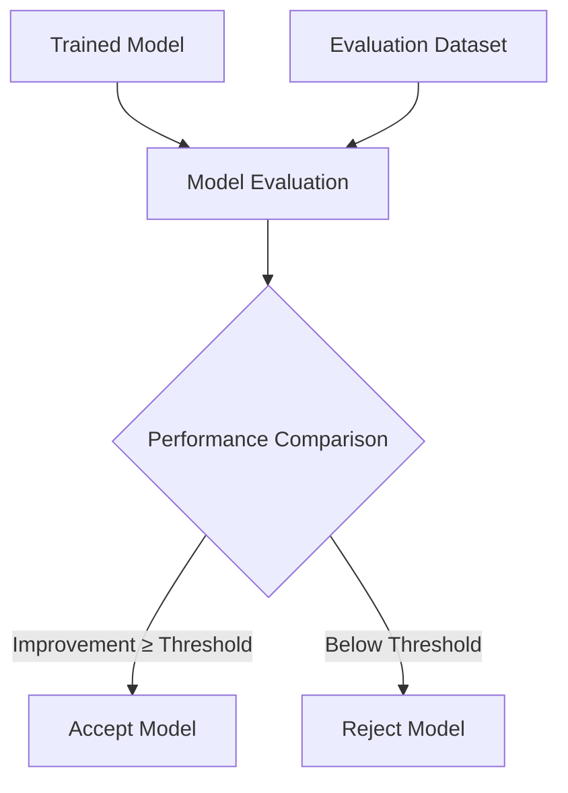

The project defines a configurable model evaluation threshold:

```text
MODEL_EVALUATION_CHANGED_THRESHOLD_SCORE = 0.02
```

This allows the pipeline to determine whether a newly trained model provides sufficient improvement before replacing the existing model.

---

# ☁️ AWS S3 Model Registry

Accepted models are stored in an **AWS S3 bucket**.

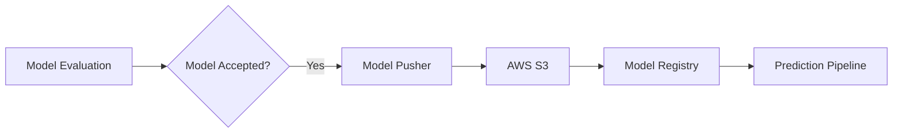

The S3 integration provides centralized storage for trained models and allows the prediction pipeline to retrieve the appropriate model.

The project uses:

```text
MODEL_BUCKET_NAME = my-model-mlopsproj
MODEL_PUSHER_S3_KEY = model-registry
```

---

# 🔮 Prediction Pipeline

Once the model has been trained and stored, the prediction pipeline loads the model and performs inference on user-provided vehicle information.

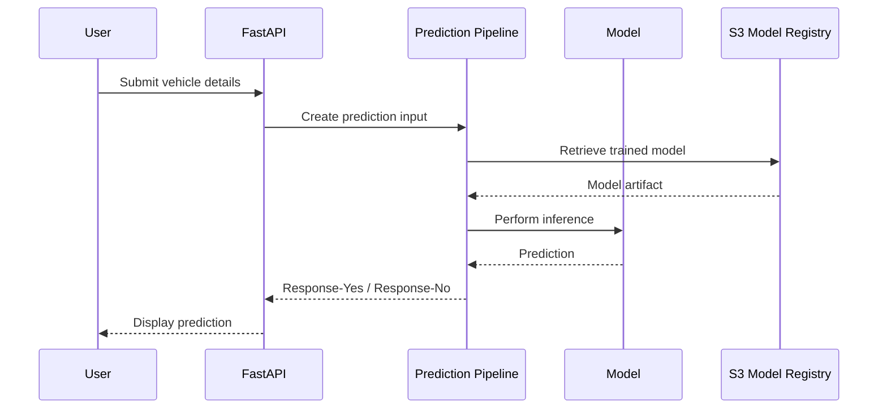

---

# 🌐 FastAPI Web Application

The trained model is exposed through a **FastAPI application**.

The application provides:

* Vehicle information input form
* Prediction endpoint
* Model training endpoint
* Prediction result rendering
* Static CSS assets
* Jinja2 HTML templates

Example application flow:

```text
User
  ↓
Vehicle Information Form
  ↓
FastAPI
  ↓
Prediction Pipeline
  ↓
Trained Model
  ↓
Prediction
  ↓
Response-Yes / Response-No
```

The application runs locally on port `5000` during development.

---

# 🐳 Dockerization

The application is containerized using Docker.


Docker provides a consistent runtime environment between development and deployment.

---

# 🔄 CI/CD Pipeline

The project implements an automated CI/CD workflow using **GitHub Actions**.

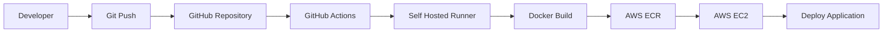

### Deployment Infrastructure

| Component          | Purpose                      |
| ------------------ | ---------------------------- |
| GitHub             | Source code management       |
| GitHub Actions     | CI/CD automation             |
| Self-hosted Runner | Executes deployment workflow |
| Docker             | Application containerization |
| AWS ECR            | Docker image registry        |
| AWS EC2            | Application hosting          |
| AWS S3             | ML model registry            |
| MongoDB Atlas      | Dataset storage              |

---

# 🚀 Deployment Workflow

The deployment architecture is:

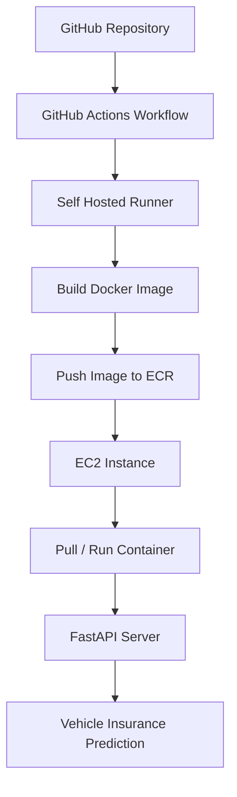

A new commit pushed to the repository triggers the CI/CD workflow.

The workflow builds the Docker image and deploys the application to the AWS infrastructure.

---

# 🛠️ Tech Stack

### Machine Learning

* Python
* Pandas
* NumPy
* Scikit-learn

### MLOps

* Modular pipeline architecture
* Data validation
* Model evaluation
* Model artifacts
* Model registry
* Logging
* Exception handling

### Backend

* FastAPI
* Uvicorn
* Jinja2

### Data

* MongoDB Atlas
* Pandas DataFrame

### Cloud & DevOps

* AWS S3
* AWS ECR
* AWS EC2
* Docker
* GitHub Actions

### Development

* Conda
* Git
* GitHub
* `setup.py`
* `pyproject.toml`

---

# ⚙️ Local Setup

## 1. Clone the repository

```bash
git clone <YOUR_REPOSITORY_URL>
cd Vehicle-Insurance-Project
```

## 2. Create the Conda environment

```bash
conda create -n vehicle python=3.10 -y
conda activate vehicle
```

## 3. Install dependencies

```bash
pip install -r requirements.txt
```

## 4. Install the local package

```bash
pip install -e .
```

Verify the installed packages:

```bash
pip list
```

---

# 🍃 MongoDB Configuration

Create a MongoDB Atlas cluster and database user.

Store the MongoDB connection string as an environment variable rather than hardcoding credentials in the source code.

### Windows CMD

```cmd
set "MONGODB_URL=mongodb+srv://<username>:<password>@<cluster>/<database>"
```

Verify:

```cmd
echo %MONGODB_URL%
```

### PowerShell

```powershell
$env:MONGODB_URL="mongodb+srv://<username>:<password>@<cluster>/<database>"
```

### Bash

```bash
export MONGODB_URL="mongodb+srv://<username>:<password>@<cluster>/<database>"
```

> ⚠️ **Security:** Never commit MongoDB credentials, AWS access keys, `.env` files, or other secrets to GitHub.

---

# ☁️ AWS Configuration

The project uses AWS S3 for model storage and AWS ECR/EC2 for deployment.

Required environment variables include:

```text
AWS_ACCESS_KEY_ID
AWS_SECRET_ACCESS_KEY
AWS_DEFAULT_REGION
```

For production deployments, credentials should be stored using a secure secret-management mechanism such as GitHub Actions Secrets or AWS IAM roles rather than hardcoded in source code.

---

# ▶️ Running the Training Pipeline

After configuring MongoDB:

```bash
python demo.py
```

The training pipeline follows:

```text
MongoDB
   ↓
Data Ingestion
   ↓
Data Validation
   ↓
Data Transformation
   ↓
Model Training
   ↓
Model Evaluation
   ↓
Model Pusher
   ↓
AWS S3
```

---

# 🌐 Running the Web Application

Start the FastAPI application:

```bash
python app.py
```

The application will be available locally at:

```text
http://127.0.0.1:5000
```

The web interface allows users to enter vehicle information and obtain an insurance response prediction.

---

# 📊 Example Prediction Workflow

```text
                    Vehicle Information
                            │
                            ▼
                    ┌───────────────┐
                    │    FastAPI    │
                    └───────┬───────┘
                            │
                            ▼
                  ┌───────────────────┐
                  │ Prediction Pipeline│
                  └─────────┬─────────┘
                            │
                            ▼
                     ┌─────────────┐
                     │ Trained ML  │
                     │    Model    │
                     └──────┬──────┘
                            │
                    ┌───────┴────────┐
                    ▼                ▼
              Response-Yes     Response-No
```

---

# 📈 MLOps Lifecycle

The complete lifecycle implemented in this project:

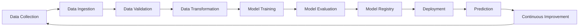

This transforms the project from a standalone ML experiment into a **repeatable ML production workflow**.

---

# 🔐 Configuration & Security

Sensitive configuration is handled through environment variables and CI/CD secrets.

The following should **never** be committed to the repository:

```text
.env
AWS credentials
MongoDB passwords
Private keys
Cloud access tokens
```

The `artifacts/` directory is also excluded from version control where appropriate.

---

# 🧪 Development Workflow

The project was developed incrementally:

```text
Project Template
      ↓
Environment & Packaging
      ↓
MongoDB Integration
      ↓
Logging & Exception Handling
      ↓
EDA & Feature Engineering
      ↓
Data Ingestion
      ↓
Data Validation
      ↓
Data Transformation
      ↓
Model Training
      ↓
Model Evaluation
      ↓
AWS S3 Model Registry
      ↓
Prediction Pipeline
      ↓
FastAPI Application
      ↓
Dockerization
      ↓
GitHub Actions
      ↓
AWS ECR
      ↓
AWS EC2 Deployment
```

---

# 💡 What This Project Demonstrates

This project demonstrates practical experience with the **engineering side of Machine Learning**, including:

* Designing maintainable ML pipelines
* Building reusable Python packages
* Connecting ML systems to cloud databases
* Automating data validation and preprocessing
* Managing model artifacts
* Evaluating and promoting models
* Building inference APIs
* Containerizing ML applications
* Implementing CI/CD for ML systems
* Deploying applications on AWS
* Separating configuration from application code
* Implementing logging and exception handling

---

# 🚧 Future Improvements

Potential extensions include:

* [ ] Add experiment tracking using MLflow
* [ ] Add automated unit and integration tests
* [ ] Add data drift monitoring
* [ ] Add model performance monitoring
* [ ] Add automated model retraining
* [ ] Introduce AWS IAM roles instead of long-lived access keys
* [ ] Add a dedicated secrets manager
* [ ] Add automated API testing
* [ ] Add model versioning and rollback
* [ ] Add monitoring and alerting
* [ ] Improve frontend UX and visualization

---

# 👨‍💻 Author

**Sankalp Singh**

M.Tech — Computer Science & Engineering
IIT Guwahati

Interested in **Machine Learning, MLOps, Deep Learning, and scalable ML systems**.

---

## ⭐ If you found this project useful

Feel free to explore the repository, raise an issue, or contribute to improving the pipeline.

**Built with Python, Machine Learning, FastAPI, MongoDB, AWS, Docker, and GitHub Actions.**
